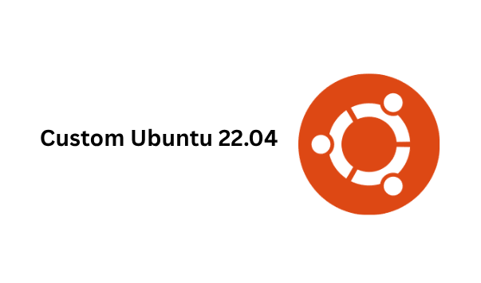

# custom-ubuntu-22.04-with-sdks-installed

---

<p align="center">
  
</p>

---


This repository provides a **customized Ubuntu 22.04 setup** tailored for robotics development.  
It includes installation scripts, configuration files, and pre-installed software for **ROS 2 Humble**, sensors, computer vision, and motor control.  

---

## Features

- Base system: **Ubuntu 22.04 LTS (Jammy Jellyfish)**
- Pre-configured for **ROS 2 Humble Hawksbill**
- Ready-to-use drivers and tools for robotics development
- Optimized environment for both **simulation** and **real hardware**

---

## Pre-Installed Software

### Core Robotics
- [ROS 2 Humble](https://docs.ros.org/en/humble/)
- `ros-humble-desktop`
- `ros-humble-navigation2`
- `ros-humble-nav2-bringup`
- `ros-humble-ros-control`
- `ros-humble-gazebo-ros-pkgs`

### Sensor & Actuator Drivers
- **LiDAR drivers**
  - RPLiDAR SDK + ROS2 package
  - Hokuyo URG ROS2 driver
- **Motor controllers**
  - `ros-humble-ros2-controllers`
  - CAN/Serial motor driver packages
- **Depth cameras**
  - Intel RealSense SDK + ROS2 wrapper

### Computer Vision
- [OpenCV 4.x](https://opencv.org/) (built with CUDA if supported)
- `cv_bridge` and `vision_opencv`

### Development Tools
- Git
- CMake
- Python 3.10 with pip
- Colcon build system
- VS Code (with ROS extension)
- Terminator terminal

### Simulation & Visualization
- Gazebo 11
- RViz 2
- RQt tools

### Utilities
- Docker & Docker Compose
- Net-tools
- htop, curl, wget
- SSH server enabled

---

## Download link

1. Download the image from this link
   ```bash
   https://drive.google.com/drive/folders/19-spk9dvJXGX38wzlc9VXHJRbiKG3tme?usp=sharing
